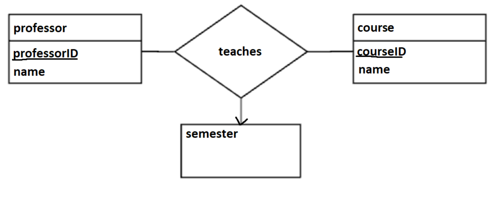
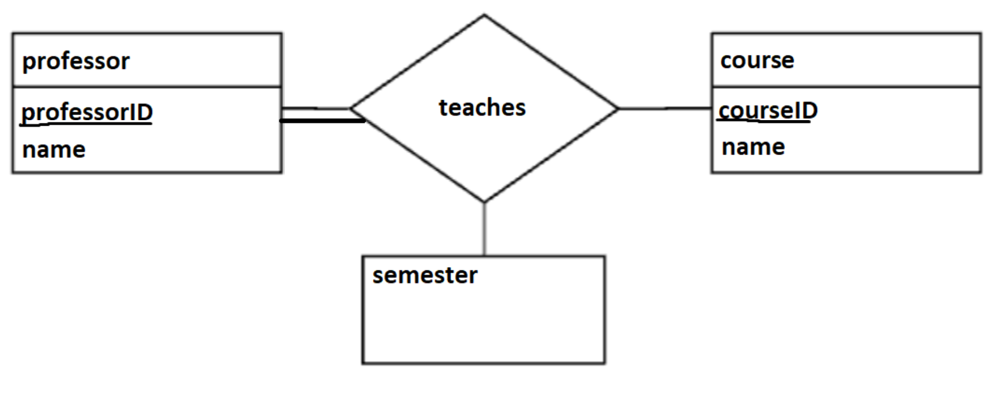
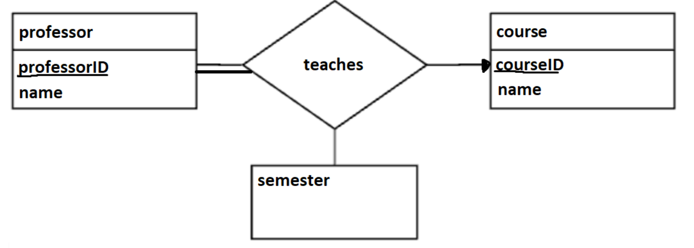
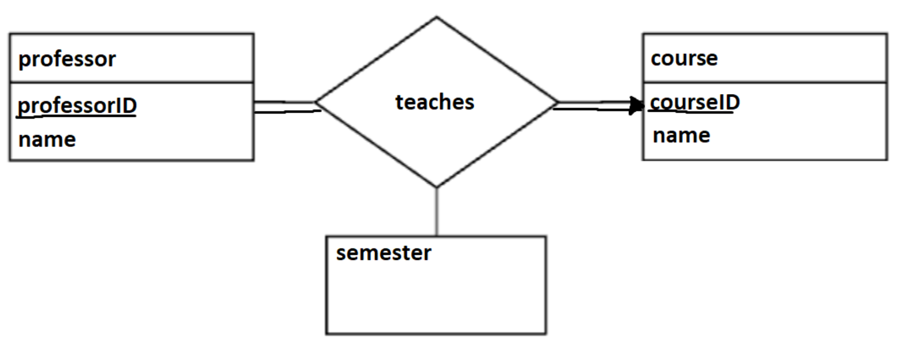
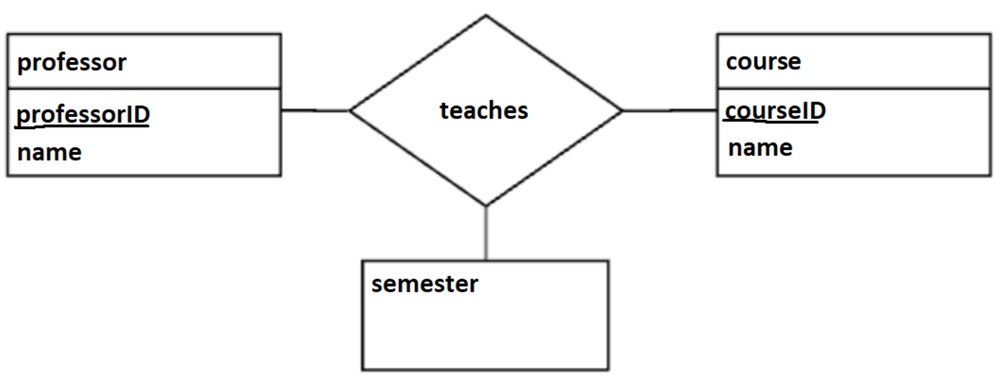
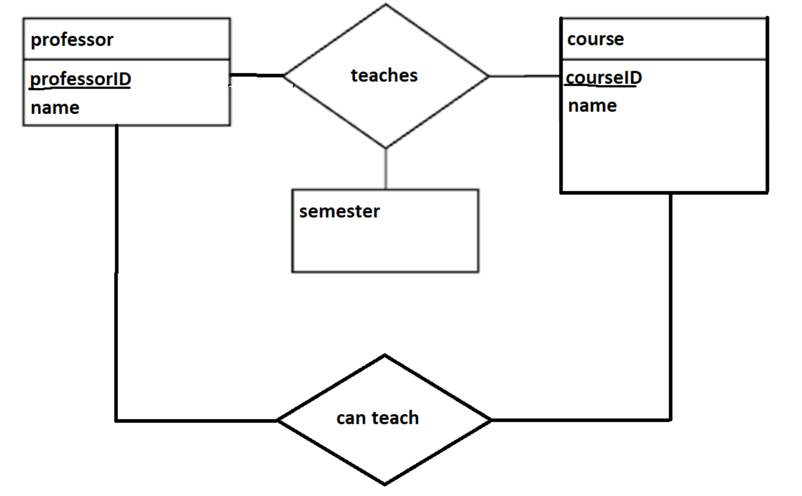
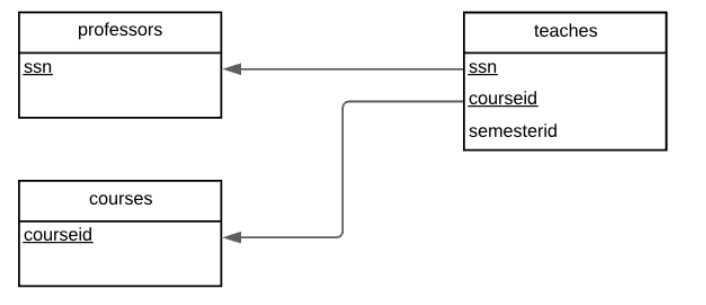
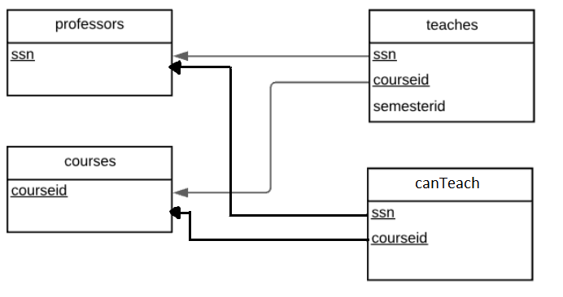

CSI2532\
Laboratoire 4\
Ahmad Charba\
300098891

Diagrammes ER
1)


2)


3)


4)


5)


6)


___

Diagrammes relationnels et SQL pour créer la table

1)

```
create table professors(ssn int);
create table courses(courseid int);
create table teaches(ssn int, courseid int, semesterid int);
```

3)

```
create table professors(ssn int);
create table courses(courseid int);
create table teaches(ssn int, courseid int, semesterid int);
```

5)

```
create table professors(ssn int);
create table courses(courseid int);
create table teaches(ssn int, courseid int, semesterid int);
```

6)

```
create table professors(ssn int);
create table courses(courseid int);
create table teaches(ssn int, courseid int, semesterid int);
create table canTeach(ssn int, courseid int);
```
